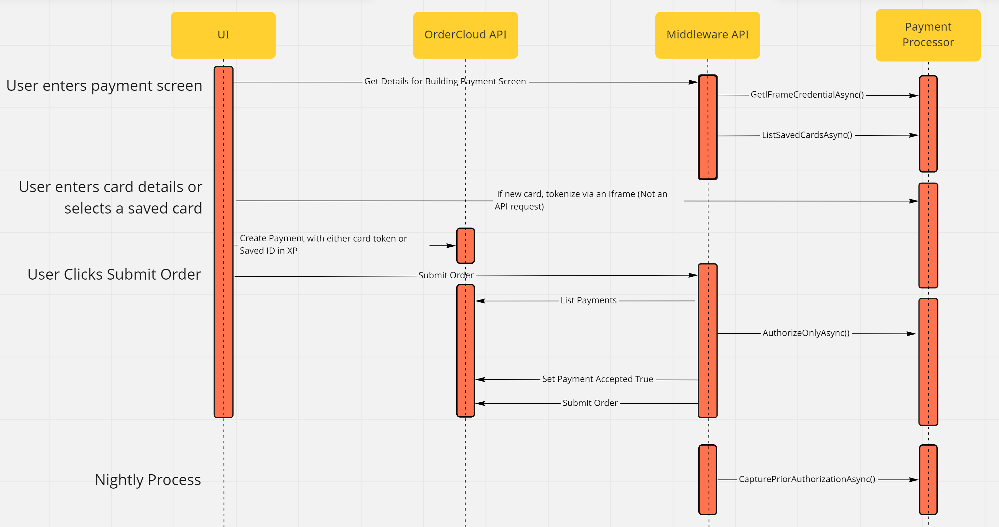

# OrderCloud.Integrations.Payment.CardConnect

This project brings payment processing to your ecommerce app using the [CardConnect](https://developer.cardpointe.com/cardconnect-api) API. It will be published as a nuget code library and conforms to the standard interfaces `ICreditCardProcessor` and `ICreditCardSaver` published in the base library ordercloud-dotnet-catalyst.

## Payment Processing Basics

The OrderCloud API does not have integration points designed specifically for payment proccesing events. Yet secure payments are critical to every Ecommerce solution. Here we will share best practices for payments which are important to understand before using this library. 

- As an online retailer, your payments technology needs to be [PCI compliant](https://www.pcicomplianceguide.org/faq/#1). This will be a much simpler process if you *correctly* use a payment gateway provider like CardConnect. Correct use means that your UI for entering card details is an Iframe owned by the payment gateway and that you never save or transmit full card numbers or CVVs. In other words, the code you write should only handle tokens or IDs representing card numbers. These tokens should be generated by the payment gateway's Iframe. Do not put full card numbers in OrderCloud!   
- The same rules apply to a user's saved cards. They should be vaulted in the processor's system, and only the Token stored in OrderCloud or your database.
- Once the user enters their payment details and you've seccurely tokenized it, what happens next? For credit cards, you have 2 choices. You can authorize the card - which verifies funds are available and holds them, but is easy to reverse with a void. Or you can authorize and capture - which begins the transfer of funds immediately, but can only be reversed with a refund (which will cost you, the merchant, a processing fee). Incorrectly placed, canceled, or refunded orders are very common in Ecommerce, so it is strongly recommended that you wait to Capture.   
- Both the authorization request and the capture request must be made from a secure server-side context. Authorization should take place only after a user has indicated they want to submit the order, but it must succeed before an Order's status should be set to submitted. A pre-webhook endpoint or a proxy endpoint for order submit are the best ways to achieve this.     
- There are different valid options for when to Capture, including when the order is shipped, a set time period after the order is placed, or in a nightly batch job.
- If you need to reverse a transaction because of a cancelation or refund, you either Void the transaction or Refund, depending on if capture has taken place. 

### Table of key credit card events

| Description | Integration Method | CardConnect Documentation | OrderCloud Platform Context |
| ------------- | ------------- | ------------- | ------------- |
| Request any creds needed to build the IFrame | ICreditCardProcessor.GetIFrameCredentialAsync() | None | Step not needed for CardConnect. Empty string will be returned. |
| Tokenize the user's card number | None | [Link](https://developer.cardpointe.com/hosted-iframe-tokenizer) | Save the token and PCI-safe card details (last 4 digits) on a Payment object attached to the Order |
| Verify and hold funds | ICreditCardProcessor.AuthorizeOnlyAsync() | [Link](https://developer.cardpointe.com/cardconnect-api#authorization) | Within a pre-webhook or proxy route list Payments, attempt to authorize using the token, set payment accepted true, create a payment transaction, and then submit the Order |
| Cancel or refund before capture | ICreditCardProcessor.VoidAuthorizationAsync() | [Link](https://developer.cardpointe.com/cardconnect-api#void) | In response to a cancelation, void server-side and create a payment transaction. |
| Capture funds | ICreditCardProcessor.CapturePriorAuthorizationAsync() | [Link](https://developer.cardpointe.com/cardconnect-api#capture) | Catpure when the order is shipped or during a nightly batch job. Create a payment transaction. |
| Cancel or refund after capture | ICreditCardProcessor.RefundCaptureAsync() | [Link](https://developer.cardpointe.com/cardconnect-api#refund) | In response to a cancelation, refund server-side and create a payment transaction. |

### Interaction Diagram for Credit Card Processing



## Package Installation 

This nuget library can be installed in the context of a .NET server-side project. If you already have a .NET project, great. If not, you can [follow this guide](https://ordercloud.io/knowledge-base/start-dotnet-middleware-from-scratch).

```dotnet add package OrderCloud.Integrations.Payment.CardConnect```

## Authentication and Injection

You will need these configuration data points to authneticate to the CardConnect API - *BaseUrl*, *APIUsername*, *APIPassword*, and *MerchantId*. You will have to request an account from CardConnect. Once you have been set up, login and go to My Account > Accounts to find your MerchantIDs. 

```c#
var cardConnectService = new CardConnectService(new CardConnectConfig()
{
	BaseUrl = $"https://{site}-uat.cardconnect.com/cardconnect/rest"" // or https://{site}.cardconnect.com/cardconnect/rest
	APIUsername = "...",
	APIPassword = "...",
	MerchantId = "..." // Note that to support different currencies will require different merchantIds
});
```

For efficient use of compute resources and clean code, create 1 CardConnectService object and make it available throughout your project using inversion of control dependency injection. 

```c#
services.AddSingleton<ICreditCardProcessor>(cardConnectService);
services.AddSingleton<ICreditCardSaver>(cardConnectService);
```

Notice that ICreditCardProcessor and ICreditCardSaver are not specific to CardConnect. They are general to the problem domain and come from the upstream ordercloud-dotnet-catalyst package. 

## Usage 

Inject the interfaces and use them within route logic. Rely on the interfaces whenever you can, not CardConnectService. The layer of abstraction that ICreditCardProcessor and ICreditCardSaver provide decouples your code from CardConnect as a specific provider and hides some internal complexity.

```c#
public class CreditCardCommand 
{
	private readonly ICreditCardProcessor _creditCardProcessor;
	private readonly ICreditCardSaver _creditCardSaver;

	public CheckoutIntegrationEventController(ICreditCardProcessor creditCardProcessor, ICreditCardSaver creditCardSaver)
	{
		// Inject interface. Implementation will depend on how services were registered, CardConnectService in this case.
		_creditCardProcessor = shipMethodCalculator; 
		_creditCardSaver = creditCardSaver;
	}

	...

	// Use in pre-submit webhook or proxy route
	public async Task<PaymentWithXp> AuthorizeCardPayment(OrderWorksheetWithXp worksheet, PaymentWithXp payment)
	{
		var authorizeRequest = new AuthorizeCCTransaction()
		{
			OrderID = worksheet.Order.ID,
			Amount = worksheet.Order.Total,
			Currency = worksheet.Order.Currency,
			AddressVerification = worksheet.Order.BillingAddress,
			CustomerIPAddress = "...",
		};
		var payWithSavedCard = payment?.xp?.SafeCardDetails?.SavedCardID != null;
		if (payWithSavedCard)
		{
			authorizeRequest.SavedCardID = payment.xp.SafeCardDetails.SavedCardID;
			authorizeRequest.ProcessorCustomerID = worksheet.Order.FromUser.xp.PaymentProcessorCustomerID;
		}
		else
		{
			authorizeRequest.CardToken = payment?.xp?.SafeCardDetails?.Token;
		}

		CCTransactionResult authorizationResult = await _creditCardProcessor.AuthorizeOnlyAsync(authorizeRequest);

		Require.That(authorizationResult.Succeeded, new ErrorCode("Payment.AuthorizeDidNotSucceed", authorizationResult.Message), authorizationResult);

		await _oc.Payments.PatchAsync<PaymentWithXp>(OrderDirection.All, worksheet.Order.ID, payment.ID, new PartialPayment { Accepted = true, Amount = authorizeRequest.Amount });
		var updatedPayment = await _oc.Payments.CreateTransactionAsync<PaymentWithXp>(OrderDirection.All, worksheet.Order.ID, payment.ID, new PaymentTransactionWithXp()
		{
			ID = authorizationResult.TransactionID,
			Amount = payment.Amount,
			DateExecuted = DateTime.Now,
			ResultCode = authorizationResult.AuthorizationCode,
			ResultMessage = authorizationResult.Message,
			Succeeded = authorizationResult.Succeeded,
			Type = PaymentTransactionType.Authorization.ToString(),
			xp = new PaymentTransactionXp
			{
				TransactionDetails = authorizationResult,
			}
		});
		return updatedPayment;
	}
}
```

This library also supports more complex cases that require mulitple merchant accounts with different credentials. For example, in a franchise business model where each location is independent but all sell on one ecommerce solution. In that case, still inject one instance of CardConnectService exactly as above. You can provide empty strings for the credentials. However, when you call methods on the interfaces, provide the optional `configOverride` parameter. 

```c#
CardConnectConfig configOverride = await FetchPaymentAccountCredentials(supplierID)
var authorize = new AuthorizeCCTransaction();
List<List<ShipMethods> rates = await _creditCardProcessor.AuthorizeOnlyAsynct(authorize, configOverride);
```
